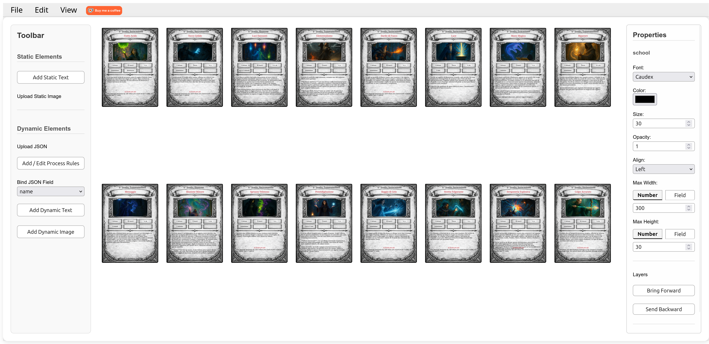

# Card Maker

This project is a visual editor to design and generate card sets for board game prototyping.

It is built around a simple idea:  
**what you see is what you get**.

You design a card once, bind it to data, and the system produces a full deck automatically.


---

## What is this for

This tool is designed for:

- Board game designers
- Tabletop game prototyping
- Rapid iteration on card layouts
- Generating printable or digital card decks from structured data

It is not a publishing tool.  
It is a fast prototyping tool.

---

## Core concepts

### 1. Dataset of cards

You start by uploading a JSON/CSV file containing your card data.

Each item in the array represents one card.

Example:

```json
[
  { "name": "Fireball", "cost": 3, "type": "Spell" },
  { "name": "Knight", "cost": 2, "type": "Unit" }
]
````


```csv
name,cost,type
Fireball,3,Spell
Knight,2,Unit
````

This dataset becomes the source of truth for all generated cards.

---

### 2. Card template editor

You visually design **one card template**.

- Add static text and images
- Add dynamic text or images bound to JSON/CSV fields
- Resize, move, align elements directly on the canvas
- Use guides and grids for precision

The editor is WYSIWYG:
what you see on screen is exactly what will be rendered.


---

### 3. Process rules (optional)

You can define rules to transform your dataset before rendering.

Examples:

- Rename keys
- Conditionally change values
- Create derived fields

This allows adapting raw data without modifying the original JSON/CSV.

---

### 4. Preview mode

You can switch to a read only preview mode that displays **all cards in a grid**.

- No interaction
- No editing
- Just visual validation of the full deck

This is useful to quickly spot layout issues or inconsistencies across cards.



---

### 5. Export

You can export:

- The template as JSON
- The full card deck as PNG images
- A zip file containing all rendered cards

This makes it easy to import the results into printing tools or tabletop simulators.

---

## Typical workflow

1. Create or import a JSON dataset of cards
2. Design a single card template visually
3. Bind template elements to data fields
4. Preview the entire deck
5. Export cards for playtesting

---

## Goal

The goal of this project is speed.

You should be able to go from an idea to a playable prototype in minutes, not days.

If you are designing a board game and need fast card iteration, this tool is for you.

---

## Quick Start

```
npm install
npm run dev
```

## Demo Link

You can test on your own on [dangerblack.github.io/card_maker](https://dangerblack.github.io/card_maker/)

## License

MIT